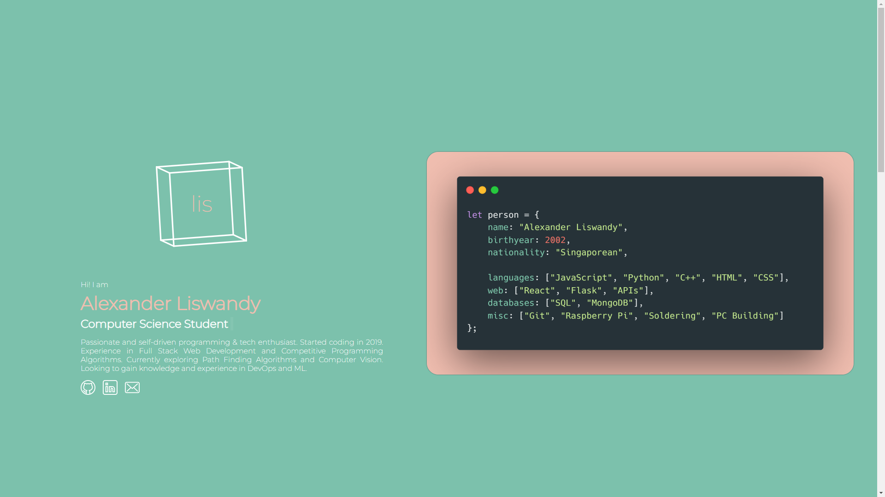

# lis - Programming Portfolio

Live at [alex.lis.fyi](https://alex.lis.fyi/)!

## Personal Portfolio Website (Work in progress)

My personal programming portfolio website made with React.

Focuses of this personal project:
1. Familiarise myself with React
2. Be conscious of UX when designing the UI
3. Create a responsive web design that looks good on all devices
4. Gain additional experience in front-end development

### TODO:
1. Improve descriptions
2. Small misc UI changes
3. Add EmailJS to contact
