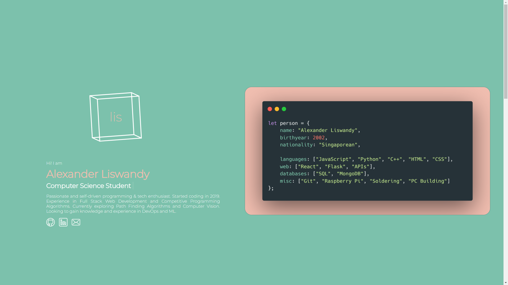

# lis - Programming Portfolio

Live at [alex.lis.fyi](https://alex.lis.fyi/)!

## Personal Portfolio Website

My personal programming portfolio website made with React.

Focuses of this personal project:
1. Familiarise myself with React
2. Familiarise myself with UIUX considerations
3. Create a responsive web design that looks good on all devices
4. Gain additional experience in front-end development

## References / Links
[Carbon image](https://carbon.now.sh/?bg=rgba%28241%2C190%2C176%2C1%29&t=material&wt=none&l=text%2Fx-scala&width=791&ds=true&dsyoff=19px&dsblur=68px&wc=true&wa=false&pv=40px&ph=49px&ln=false&fl=1&fm=Hack&fs=14px&lh=142%25&si=false&es=4x&wm=false&code=val%2520person%2520%253D%2520Person%28%250A%2520%2520name%2520%253D%2520%2522Alexander%2520Liswandy%2522%252C%250A%2520%2520birthYear%2520%253D%25202002%252C%250A%2520%2520nationality%2520%253D%2520%2522Singaporean%2522%252C%250A%2520%2520%250A%2520%2520languages%2520%253D%2520List%28%2522Scala%2522%252C%2520%2522Java%2522%252C%2520%2522TypeScript%2522%252C%2520%2522Pythong%2522%2520%2522C%252B%252B%2522%29%252C%250A%2520%2520webTechnologies%2520%253D%2520List%28%2522Finatra%2522%252C%2520%2522Spring%2522%252C%2520%2522FastAPI%2522%252C%2520%2522React%2522%29%252C%250A%2520%2520databases%2520%253D%2520List%28%2522MongoDB%2522%2520%252C%2522PostgreSQL%2522%29%252C%250A%2520%2520tools%2520%253D%2520List%28%2522Git%2522%252C%2520%2522Docker%2522%252C%2520%2522AWS%2522%252C%2520%2522Linux%2522%29%250A%29)
